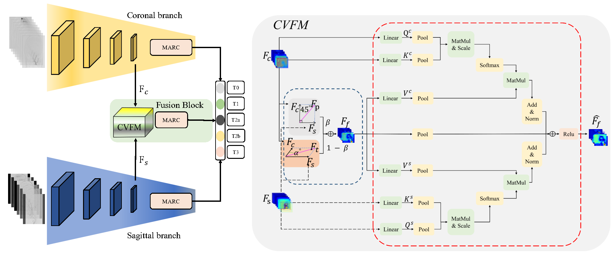
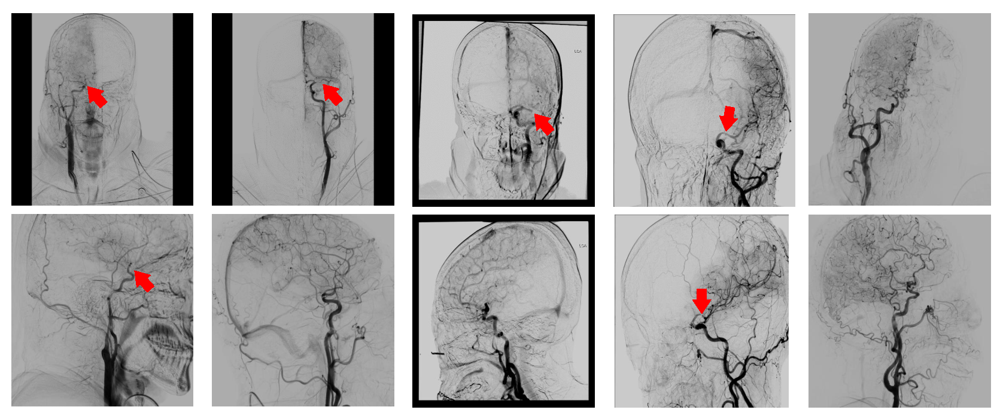
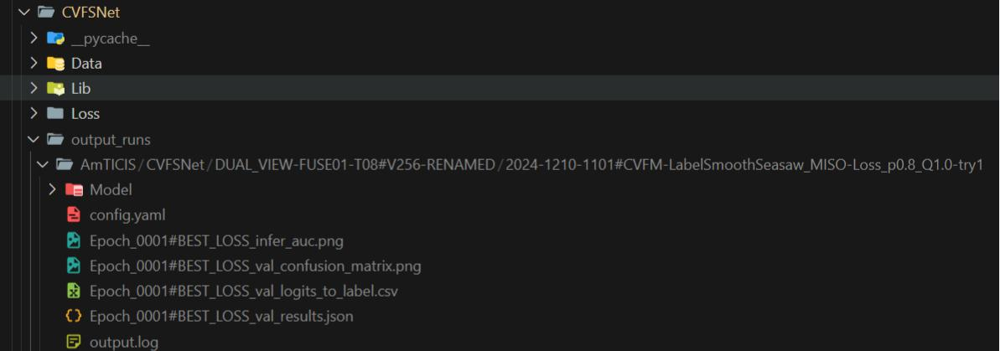

**CVFSNet: A Cross View Fusion Scoring Network for end-to-end mTICI Scoring**
==============================================================================================================================

Created by Weijin Xu, Tao Tan, Huihua Yang, Wentao Liu, Yifu Chen, Ling Zhang, Xipeng Pan, Feng Gao, Yiming Deng, Theo
van Walsum, Matthijs van der Sluijs, Ruisheng Su

Prequisites
------------
Please see requirtments.txt

Introduction
------------
The modified Thrombolysis In Cerebral Infarction (mTICI) score serves as one of the key clinical indicators to assess the success of the Mechanical Thrombectomy (MT), requiring physicians to inspect Digital Subtraction Angiography (DSA) images in both the coronal and sagittal views. However, assessing mTICI scores manually is time-consuming and has considerable observer variability. An automatic, objective, and end-to-end method for assigning mTICI scores may effectively avoid observer errors. Therefore, in this paper, we propose a novel Cross View Fusion Scoring Network (CVFSNet) for automatic, objective, and end-to-end mTICI scoring, which employs dual branches to simultaneously extract spatial-temporal features from coronal and sagittal views. Then, a novel Cross View Fusion Module (CVFM) is introduced to fuse the features from two views, which explores the positional characteristics of coronal and sagittal views to generate a pseudo-oblique sagittal feature and ultimately constructs more representative features to enhance the scoring performance. In addition, we provide AmTICIS, a newly collected and the first publicly available DSA image dataset with expert annotations for automatic mTICI scoring, which can effectively promote researchers to conduct studies of ischemic stroke based on DSA images and finally help patients get better medical treatment. Extensive experimentation results demonstrate the promising performance of our methods and the validity of the cross-view fusion module. 

Step 1 Download the AmTICIS dataset
------------
The AmTICIS have been publish in zenodo under Creative Commons Attribution Non Commercial No Derivatives 4.0 International license at https://zenodo.org/records/17790966. 

Step 2 Setup the config file
------------------------
Change the training setup as you want in config.py

Step 3 Train and Val
------------------------
you can use the follow command to train and val,

<pre><code>python main.py --opts --nodebug --options</pre></code>

for example:
<pre><code>python main.py --no_debug --opts LOSS.Para.p 0.8 LOSS.Para.q 1.0 BASIC.Seed 1407 METHOD.Desc DUAL_VIEW-FUSE01-T08#V256-RENAMED/CVFM-LabelSmoothSeasaw_MISO-Loss_p0.8_Q1.0-NEW-try3 DATA.Train.DataPara.fast_time_size 8 DATA.Train.DataPara.visual_size 256 DATA.Train.LoaderPara.batch_size 4 DATA.Train.LoaderPara.num_workers 8 DATA.Val.DataPara.fast_time_size 8 DATA.Val.DataPara.visual_size 256 DATA.Val.LoaderPara.batch_size 4 DATA.Val.LoaderPara.num_workers 8 MODEL.Para.input_clip_length 8 MODEL.Para.input_crop_size 256
</pre></code>

if you specify the --no_debug flag, the code will consider you in a formally training, it will automaticlly add a git commit with info as METHOD.DESC, and wandb will log your curve and upload the wandb server. The output data will be stored in:

/$ROOT$/output_runs/AmTICIS/CVFSNet/METHOD.DESC/$TIMESTAMP$/METHOD.Desc

EG: /ai/mnt/code/CVFSNet/output_runs/AmTICIS/CVFSNet/DUAL_VIEW-FUSE01-T08#V256-RENAMED/2024-1209-1653#CVFM-LabelSmoothSeasaw_MISO-Loss_p0.8_Q1.0

else if you do not pass the --no_debug flag, the code will consider you in the debug mode, and not add a git commit, the wandb will log your curve but do not upload the wandb server. The output data will be stored in:

/$ROOT$/output_runs/AmTICIS/DEBUG/METHOD.DESC/$TIMESTAMP$/METHOD.Desc

EG: /ai/mnt/code/CVFSNet/output_runs/AmTICIS/DEBUG/DUAL_VIEW-FUSE01-T08#V256-RENAMED/2024-1209-1653#CVFM-LabelSmoothSeasaw_MISO-Loss_p0.8_Q1.0

$NOTE$ if metrics have been stop updating for 70 (_C.BASIC.Early_stop) epochs, it will automaticlly stop training and going to inference.

Step 4 Inference
------------------------

<pre><code>python infer.py --infer_path $infer_path$ --epochs $epoch_id$</pre></code>

EG: python infer.py --infer_path /ai/mnt/code/CVFSNet/output_runs/AmTICIS/DEBUG/DUAL_VIEW-FUSE01-T08#V256-RENAMED/2024-1209-1653#CVFM-LabelSmoothSeasaw_MISO-Loss_p0.8_Q1.0 --epochs -1

epochs == -1 indicates inferring all saved models, if else, please specify the epoch number.

the saved data shown as following:

Step 5 Check Results
------------------------
After inferencing, the results will be save in AmTICIS_results.csv, you can sorting or filtering the results from different methods.

Citation
------------------------

if you find the CVFSNet and AmTICIS useful, please cite below:

Xu, W., Tan, T., Yang, H., Liu, W., Chen, Y., Zhang, L., ... & Su, R. (2025). CVFSNet: A Cross View Fusion Scoring Network for end-to-end mTICI scoring. Medical Image Analysis, 102, 103508.

License
--------

The CVFSNet code and AmTICIS dataset are released under Creative Commons Attribution Non Commercial No Derivatives 4.0 International license.
